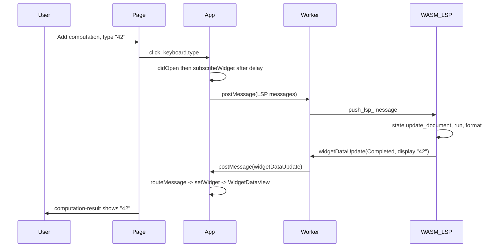

# E2E test for editor–worker connection and protocol (reviewed)

## Overview

Add a Playwright E2E test that runs in a **real browser** (Chromium), exercises the full editor → Worker → WASM LSP → result path, and optionally asserts that the LSP protocol messages (didOpen, subscribeWidget, widgetDataUpdate) were sent and received. The test lives in the existing Playwright suite and runs with `pnpm smoketest` / `pnpm smoketest:dev`.

---

## Review: improvements over initial plan

- **Protocol log scope**: Clear `window.__E2E_LSP_LOG__` **after** the editor is visible and **before** typing "42", so the assertion only checks messages from that single interaction (no initialize/initialized/nodeSignatureUpdated noise).
- **Log only LSP messages**: When pushing to the log, parse the message and push only if it is JSON-RPC (has `method`). Skip control messages: `init`, `snaqlite-worker-ready`, `snaqlite-worker-error`. For incoming messages, push only notifications (has `method`, no `id`) so we don’t double-count or mix responses.
- **Assertion strength**: Optionally log `params` for notifications and assert that the `widgetDataUpdate` entry has `params.status === 'Completed'` and that the result area shows "42".
- **Failure diagnosis**: Add a short "If the test fails" section: run in headed mode, verify manually that typing in the editor shows the result, and check console for `[useSubscribeWidget] subscribeWidget failed:` to distinguish Monaco/focus issues from LSP/worker issues.
- **Out of scope**: This test targets a single computation block and scalar result ("42"). It does not cover presentation blocks, vector/stream results, or error states (those can be separate tests later).

---

## 1. E2E test: computation result shows after typing (real browser)

**File**: New [apps/frontend/e2e/computation-result.spec.ts](apps/frontend/e2e/computation-result.spec.ts) (dedicated spec for this flow).

**Flow**:

1. Reuse or copy the `gotoCanvas(page)` pattern (navigate to `/`, click New project, expect canvas and toolbar).
2. Add computation box: `page.getByTestId('add-computation-btn').click()`.
3. Wait for node and editor:  
   `await expect(page.getByTestId('computation-editor-zone').first()).toBeVisible({ timeout: 10_000 })`.  
   Optionally wait for Monaco to be in DOM: `page.locator('.monaco-editor').first().waitFor({ state: 'attached', timeout: 5_000 })` if needed for stability.
4. Focus editor: click `computation-editor-zone` once. If focus is flaky, add a short `page.waitForTimeout(200)` and/or use `page.locator('.monaco-editor').first().click()`.
5. Type: `await page.keyboard.type('42')`. Do **not** use `fill()`; Monaco is not a textarea.
6. Assert result:  
   `await expect(page.getByTestId('computation-result').first().getByText('42')).toBeVisible({ timeout: 15_000 })`.

**Test timeout**: `test.setTimeout(20_000)` for this test so WASM load and LSP handshake don’t cause flakes.

**Why this validates the connection**: If the result shows "42", the full path ran: main thread → postMessage → worker → WASM LSP (didOpen + subscribeWidget) → run → widgetDataUpdate → postMessage → main thread → routeMessage → setWidget → WidgetDataView.

---

## 2. Optional: protocol-level assertions (LSP messages)

**Goal**: Assert that the LSP protocol was used (didOpen, subscribeWidget, widgetDataUpdate) in a real browser, without mocking.

**App-side (minimal, no-op when hook absent)**:

- In [apps/frontend/src/lsp/message-router.ts](apps/frontend/src/lsp/message-router.ts):
  - **Outgoing** (`sendToWorker`): If `typeof window !== 'undefined' && (window as any).__E2E_LSP_LOG__` is an array, parse the message string as JSON. If it has a `method` property and is **not** a control message (e.g. `method` not in `['init']` and payload not `{ type: 'init', ... }`), push `{ dir: 'out', method: msg.method }`. Ignore non-JSON or missing method.
  - **Incoming** (`processIncomingMessage`, before `routeMessage(raw)`): If the same global exists and `raw` parses as JSON with a `method` and **no** `id` (i.e. notification), push `{ dir: 'in', method: parsed.method, params: parsed.params }` (params optional, for asserting status later).

**E2E-side**:

1. **Before any navigation**:  
   `await page.addInitScript(() => { (window as any).__E2E_LSP_LOG__ = [] })`
2. **After** gotoCanvas, add computation, and **after** editor zone is visible:  
   Clear the log so we only capture the "type 42 → result" round-trip:  
   `await page.evaluate(() => { (window as any).__E2E_LSP_LOG__ = [] })`
3. **Then** focus editor, type "42", and wait for result to show "42".
4. **Assert log**:  
   `const log = await page.evaluate(() => (window as any).__E2E_LSP_LOG__ || [])`  
   - At least one entry with `dir === 'out'` and `method === 'textDocument/didOpen'`.
   - At least one entry with `dir === 'out'` and `method === 'snaqlite/graph/subscribeWidget'`.
   - At least one entry with `dir === 'in'` and `method === 'snaqlite/graph/widgetDataUpdate'`.  
   If we logged `params`, optionally assert that this entry has `params.status === 'Completed'`.

No new dependencies; normal app and unit tests never set the global, so no impact.

---

## 3. If the test fails

- **Run headed**: `PLAYWRIGHT_REUSE_SERVER=1 pnpm run smoketest:dev -- --headed` (with dev server already running) to watch the run.
- **Manual check**: In the same build, open the app, add a computation block, type "42", and see if the result appears. If it does, the failure is likely timing or selector (Monaco focus / visibility). If it doesn’t, the bug is in the app (LSP/worker/protocol).
- **Console**: Check for `[useSubscribeWidget] subscribeWidget failed:` in the browser console to see if the LSP is rejecting the request (e.g. "source document not open").
- **Stability**: If "result shows 42" passes but protocol assertions fail, the log might be missing notifications (e.g. routing or timing). Prefer fixing the app so the result appears and the protocol log is consistent, rather than relaxing the protocol assertions.

---

## 4. Diagram (flow under test)

---

## 5. Checklist

| Step | Action |
|------|--------|
| 1 | Create `apps/frontend/e2e/computation-result.spec.ts` with one test: gotoCanvas, add computation, wait for editor zone, click to focus, keyboard.type('42'), expect computation-result to contain "42" (timeout 15s), test timeout 20s. |
| 2 | (Optional) In message-router: when `window.__E2E_LSP_LOG__` exists, push out/in LSP message descriptors (method; for notifications, include params). Skip control messages. |
| 3 | (Optional) In same test: addInitScript to create `__E2E_LSP_LOG__`; after editor visible, clear log; after typing and result visible, assert log has at least one didOpen (out), one subscribeWidget (out), one widgetDataUpdate (in); optionally assert params.status === 'Completed'. |
| 4 | Run `pnpm smoketest` (or `pnpm smoketest:dev` with dev server) and confirm the test passes. |

---

## 6. Out of scope (for this test)

- Presentation block widget subscription.
- Vector/stream results.
- Error states (parse error, runtime error in result).
- Native LSP (stdio); only the browser Worker + WASM path is under test.

---

## 7. Running

- From repo root: `pnpm smoketest` (build + Playwright with preview).  
- With dev server: `pnpm smoketest:dev` (Playwright only, reuse server).  
- From apps/frontend: `pnpm run smoketest` / `pnpm run smoketest:dev`.

The new spec runs with the existing Playwright config (Chromium, same webServer/reuseServer rules).
